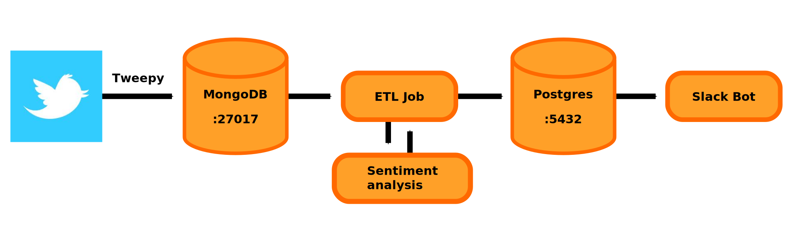

# Twitter-sentiment-analysis

This project aims to build a Dockerized Data Pipeline that analyzes the sentiment of tweets. It consists of five components :

1- collects the tweets with a specific tag (for example I used "berlin").

2- stores the tweets in a Mongo database.

3- an ETL job that read the tweets from Mongo DB and computes the sentiment for the tweet with vaderSentiment.

VADER (Valence Aware Dictionary and sEntiment Reasoner) is a lexicon and rule-based sentiment analysis tool that is specifically attuned to sentiments expressed in social media.

4- stores the tweets with their accordings sentiment into a Postgres database.

5- a slack bot that will post a tweet with its sentiment every period of time.

Each component will run in a separate docker container, managed by docker-compose file (docker-compose.yml).

### Usage:
- Install Docker: https://docs.docker.com/get-docker/
- clone the repo
- You will need to obtain twitter credentials at https://developer.twitter.com/en/apps

  after getting please place them in: tweet_collector/config.py as the following:
  
  API_KEY = ""              # provide your API key
  
  API_SECRET = ""   # provide your API secret
  
  ACCESS_TOKEN = ""  # provide your access token
  
  ACCESS_TOKEN_SECRET = " "  # provide your access token secret
  
- you need to register an app at slack.api and get Bot User OAuth Access Token
 
  after getting it please place it in: slackbot/config.py as the following:
  
  webhook_url = '  '
  
- you can modify tweet_collector.py , to get tweets about specific tag as following:

  twitter_streamer = TwitterStreamer(['berlin'])
  
- Go to the main folder of the project in the terminal and run docker-compose build && docker-compose up

The tweets will be posted in Slack like this:

### Tech used:
    Python
    Docker
    MongoDB
    PostgreSQL
    SQLAlchemy
    pymongo
    VaderSentiment
    Slack

## License

- **[MIT license](http://opensource.org/licenses/mit-license.php)**

